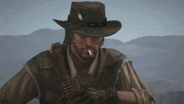

<p align="center">
  
</p>

<p align="center">
  <a href="https://github.com/yannbastos"></a>
  
  <!-- <a href="https://www.linkedin.com/in/SEU-USUARIO"></a> -->
</p>

<p align="center"></p>

### 🕯️ Bonfire

<sub><i>Rest here, traveler.</i></sub>

```yaml
yann@bonfire:~$ cat character.sheet
───────────────────────────────────────────────
Class      : Frontend-focused Full Stack Developer
Guild      : WEG — Junior Developer
Training   : Software Engineering @ Católica SC
Origin     : Jaraguá do Sul, SC — Brazil
OS         : EndeavourOS / Windows (dual boot)
Languages  : pt-BR · en · es
Pronouns   : he/him
Hobbies    : Gaming · Movies · Reading
Worlds     : Dark Souls · Elden Ring · The Witcher · Red Dead
             Assassin's Creed · DOOM · League of Legends · Hytale
Library    : Manga · Philosophy
Discord    : granulado
```

<p align="center"></p>

### 📜 Contracts

<sub><i>Notice board — taken, fulfilled, and still open.</i></sub>



- [x] Build internal enterprise web apps at WEG
- [x] Ship frontend prototypes with the WEG Design System
- [x] Survive RPA with Blue Prism
- [ ] Standardize the frontend with shared guidelines & Storybook
- [ ] Graduate in Software Engineering @ Católica SC
- [ ] Clear the backlog of games

<br clear="right" />

<p align="center"></p>

### ⚔️ Arsenal

<sub><i>Steel for the daily grind, silver for the monsters.</i></sub>

**Steel** · daily stack


**Silver** · data & automation


**Saddlebag** · tools


**Side quests**


<details>
  <summary><sub>☠️ Prepare to debug</sub></summary>

```text
CONTRACT ACCEPTED ....... git checkout -b feat/new-quest
BONFIRE LIT ............. git commit -m "checkpoint"
YOU DIED ................ git revert HEAD
WANTED: DEAD OR ALIVE ... git blame
```

</details>

<p align="center"></p>

### 🗺️ Trail

<sub><i>Every commit leaves a track.</i></sub>

<p align="center">
  
</p>

<picture>
  <source media="(prefers-color-scheme: dark)" srcset="https://raw.githubusercontent.com/yannbastos/yannbastos/output/snake-dark.svg" />
  <source media="(prefers-color-scheme: light)" srcset="https://raw.githubusercontent.com/yannbastos/yannbastos/output/snake.svg" />
  
</picture>

<p align="center"></p>

<p align="center">
  <i>"There is only one good, knowledge, and one evil, ignorance."</i><br />
  <sub>— Socrates (c. 470 – 399 BC), as recorded by Diogenes Laërtius</sub>
</p>


